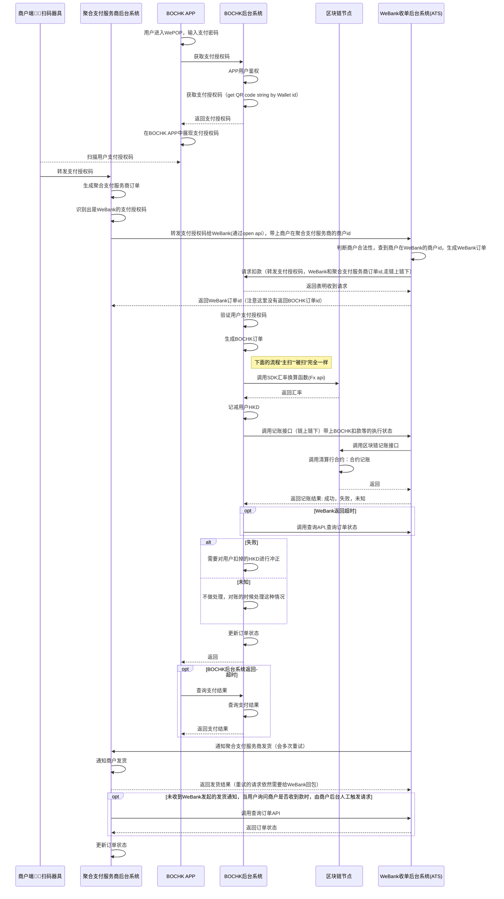

<html>
<head>

<!--区块链跨境钱包发卡行前置SDK使用文档-->
</head>
<body>
</body>
</html>

```mermaid
%% 被扫
sequenceDiagram
    participant 商户端扫码器具
    participant 聚合支付服务商后台系统
    participant BOCHK APP
    participant BOCHK后台系统
    participant 区块链节点
    participant WeBank收单后台系统(ATS)

    BOCHK APP->>BOCHK APP: 用户进入WePOP，输入支付密码
    BOCHK APP->>BOCHK后台系统: 获取支付授权码
    BOCHK后台系统->>BOCHK后台系统: APP用户鉴权
    BOCHK后台系统->>BOCHK后台系统: 获取支付授权码（get QR code string by Wallet id）
    BOCHK后台系统-->>BOCHK APP: 返回支付授权码
    BOCHK APP->>BOCHK APP: 在BOCHK APP中展现支付授权码
    商户端扫码器具-->>BOCHK APP: 扫描用户支付授权码
    商户端扫码器具->>聚合支付服务商后台系统: 转发支付授权码
    聚合支付服务商后台系统->>聚合支付服务商后台系统: 生成聚合支付服务商订单
    聚合支付服务商后台系统->>聚合支付服务商后台系统: 识别出是WeBank的支付授权码
    聚合支付服务商后台系统->>WeBank收单后台系统(ATS): 转发支付授权码给WeBank(通过open api），带上商户在聚合支付服务商的商户id

    WeBank收单后台系统(ATS)->>WeBank收单后台系统(ATS): 判断商户合法性，查到商户在WeBank的商户id，生成WeBank订单
    WeBank收单后台系统(ATS)->>BOCHK后台系统: 请求扣款（转发支付授权码，WeBank和聚合支付服务商订单id,走链上链下）
    %%
    BOCHK后台系统-->>WeBank收单后台系统(ATS): 返回表明收到请求
    WeBank收单后台系统(ATS)-->>聚合支付服务商后台系统: 返回WeBank订单id（注意这里没有返回BOCHK订单id）

    BOCHK后台系统->>BOCHK后台系统: 验证用户支付授权码
    BOCHK后台系统->>BOCHK后台系统: 生成BOCHK订单

    Note right of BOCHK后台系统: 下面的流程“主扫”“被扫”完全一样
    %%
    BOCHK后台系统->>区块链节点: 调用SDK汇率换算函数(Fx api)
    区块链节点-->>BOCHK后台系统: 返回汇率
    BOCHK后台系统->>BOCHK后台系统: 记减用户HKD
    BOCHK后台系统->>WeBank收单后台系统(ATS): 调用记账接口（链上链下）带上BOCHK扣款等的执行状态

    WeBank收单后台系统(ATS)->>区块链节点: 调用区块链记账接口
    区块链节点->>区块链节点: 调用清算行合约：合约记账
    区块链节点-->>WeBank收单后台系统(ATS): 返回
    WeBank收单后台系统(ATS)-->>BOCHK后台系统: 返回记账结果: 成功，失败，未知
    opt WeBank返回超时
        BOCHK后台系统->>WeBank收单后台系统(ATS): 调用查询API,查询订单状态
    end
    alt 失败
        BOCHK后台系统->>BOCHK后台系统: 需要对用户扣掉的HKD进行冲正
    else 未知
        BOCHK后台系统->>BOCHK后台系统: 不做处理，对账的时候处理这种情况
    end
    BOCHK后台系统->>BOCHK后台系统: 更新订单状态
    BOCHK后台系统-->>BOCHK APP: 返回

    opt BOCHK后台系统返回超时
      BOCHK APP->>BOCHK后台系统: 查询支付结果
      BOCHK后台系统->>BOCHK后台系统: 查询支付结果
      BOCHK后台系统-->>BOCHK APP: 返回支付结果
    end

    WeBank收单后台系统(ATS)->>聚合支付服务商后台系统: 通知聚合支付服务商发货（会多次重试）
    聚合支付服务商后台系统->>聚合支付服务商后台系统: 通知商户发货
    聚合支付服务商后台系统-->>WeBank收单后台系统(ATS): 返回发货结果（重试的请求依然需要给WeBank回包）

    opt 未收到WeBank发起的发货通知，当用户询问商户是否收到款时，由商户后台人工触发请求
        聚合支付服务商后台系统->>WeBank收单后台系统(ATS): 调用查询订单API
        WeBank收单后台系统(ATS)-->>聚合支付服务商后台系统: 返回订单状态
    end

    聚合支付服务商后台系统->>聚合支付服务商后台系统: 更新订单状态

```
