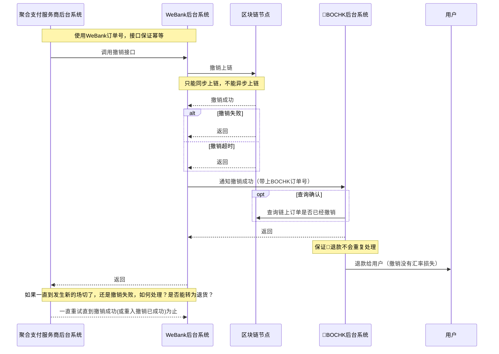
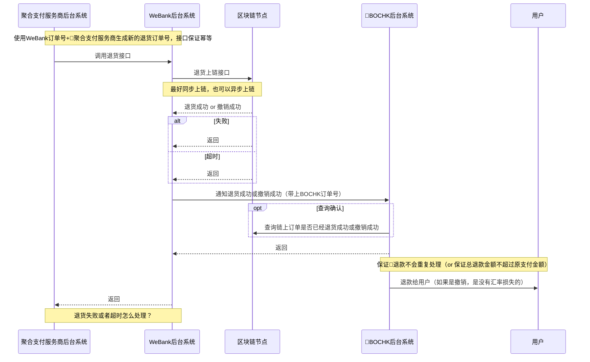

<html>
<head>

<!--区块链跨境钱包发卡行前置SDK使用文档-->
</head>
<body>
</body>
</html>

## 撤销流程
撤销由商户主动发起，例如被扫的时候，商户的扫码枪扫描了用户的支付授权码，转发支付授权码给WeBank后，如果30秒以内没有收到WeBank的发货通知，会主动调用WeBank提供的撤销接口。

* 清算行清算的时候发现是撤销的订单直接不清算，WeBank二清的时候发现是撤销的订单也不清算给商户，所以境外合作行可以全款推给用户

## 退货流程
由用户触发，找到商户要求退货，聚合支付服务商再调用WeBank提供的退货接口。
注：在场切之前发起的退货，会自动标识为撤销，用户没有任何损失。

* 如果是退货：港中银可以在收到退货通知的时候，直接把钱退给用户，
* 如果是撤销：

