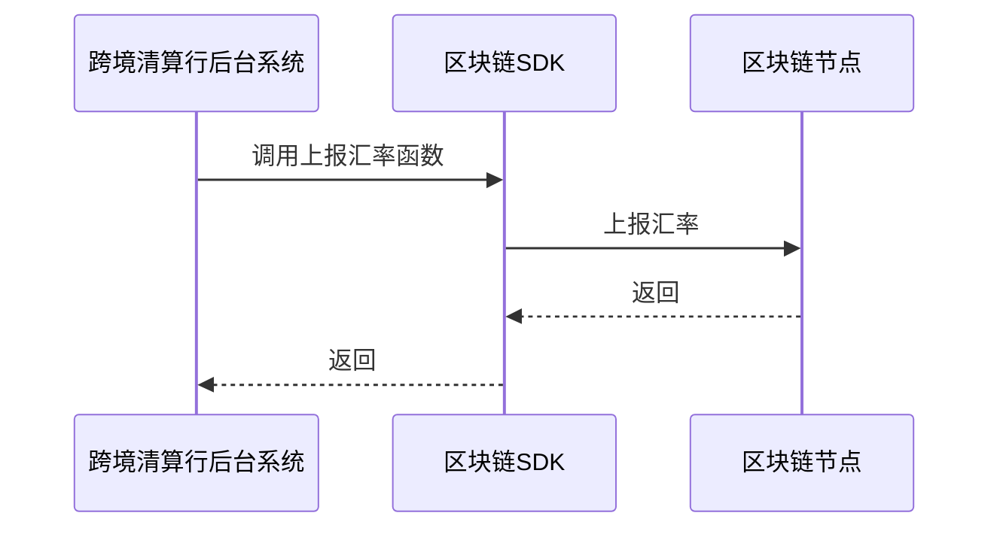
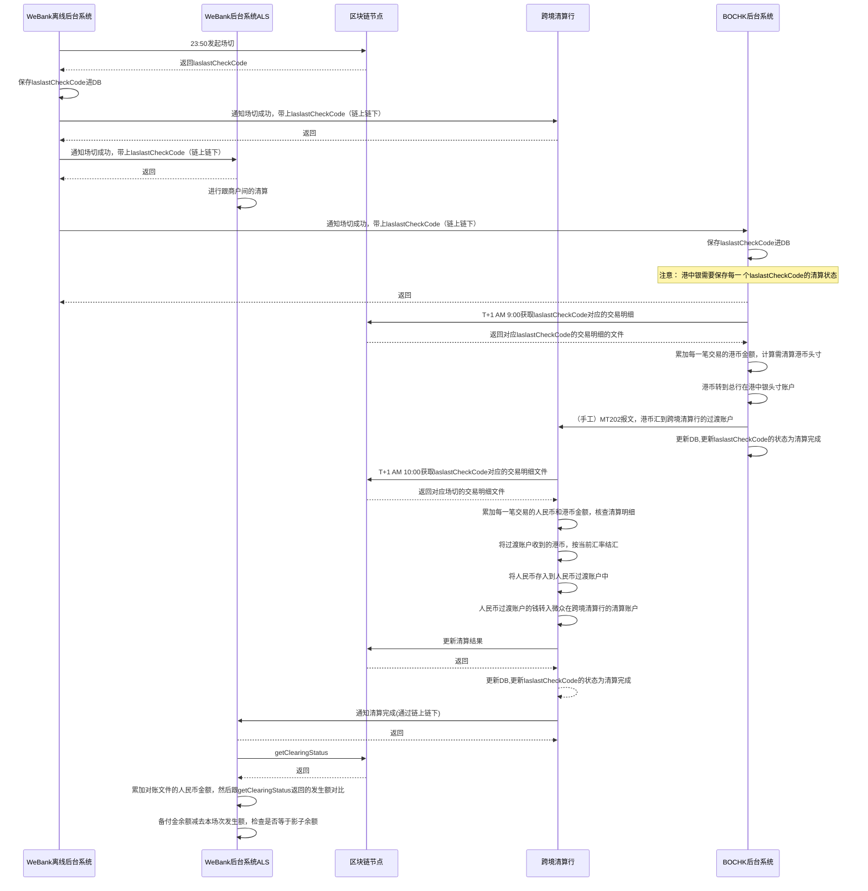

<html>
<head>
<style>
*
{
   font-family: 仿宋;
}

@media screen {
  div.divFooter {
    display: none;
  }
}
@media print {
  div.divFooter {
    position: fixed;
    bottom: 0;
  }
}

table {
    width: 200px;
    max-width: 65em;
    border: 1px solid #dedede;
    margin: 15px auto;
    border-collapse: collapse;
    empty-cells: show;
}

td.last {
    width: 10px;
    white-space: nowrap;
}


table td{
    border:1px solid #000;
}

tr td:last-child{
  width:1%;
white-space:nowrap;
}
</style>
<!--区块链跨境钱包境外合作行前置SDK使用文档-->
</head>
<body>
</body>
</html>


## 1. 背景介绍
* 项目介绍：本项目是使用区块链技术，连接境外合作行，内地商户接入行，跨境清算行和内地商户，解决境外游客来中国大陆消费的移动支付痛点，探索区块链在低风险金融场景中的应用。
* 本文档是区块链跨境钱包跨境清算行SDK的使用说明。通过这个SDK，可以简化跨境清算行后台server调用区块链的复杂度。直接使用函数调用的方式使用区块链。
* 背景知识：区块链跨境钱包项目的架构。


## 2. 前提条件

* 目前只提供了JAVA版本的SDK。需要JDK至少 1.7 。

## 3. 上报汇率

#### 3.1. 介绍

跨境清算行通过SDK提供的接口上报当前汇率，需要同时上报买入价和卖出价。

#### 3.2. 时序图




## 4. 清算与对账

#### 4.1. 流程

1.清算行根据业务的需求，按一定时间间隔调用SDK发起场切
2.场切成功后，调用SDK开始拉取上一场的交易流水文件
3.交易明细对账，资金清算
4.清算完成后，更新链上清算结果
5.通知BOCHK清算完成
6.通知WeBank清算完成

#### 4.2. 时序图

* 为简化，合并了跨境清算行的后台系统，统称为“跨境清算行后台系统”
* 下图为924的清算逻辑
* laslastCheckCode代表场切成功后得到的场切码




## 5. SDK接口文档

#### 5.1. 上报汇率接口

* 调用示例:

```java
String toOrgId = "BOCHK";
ExchangeRate arg = new ExchangeRate();
arg.setCurrency(CurrencyType.CURRENCY_TYPE_HKD);
arg.setFxRate(8760);
arg.setRefundFxRate(8860);
arg.setExTimestamp(1434343431);
arg.setCurrencyUnit(10000);

ResponseStruct<TxExecuteResult> responseStruct = clearingBankClient.setExchangeRate(toOrgId, arg);

log.info("respObj body : {}" + responseStruct);
if (0 == responseStruct.getErrorCode()) {
    if (responseStruct.getResult().isSucc()) {
        log.info("status : setExchangeRate succ!");
    } else {
        log.info("status : setExchangeRate failed!");
    }
} else {
    log.info("status : setExchangeRate failed!");
}
```

* toOrgId说明:每一个境外合作行使用不同的合约，所以需要指定机构的id，用于区分不同的境外合作行
* ExchangeRate说明:

|字段名|必选|类型|说明|
|:----    |:---|:----- |----- |
|currency  | 是  |Integer | 币种 |
|fxRate  |是  |Integer| 兑换汇率  |
|refundFxRate |是  | Integer |退货时的兑换汇率  |
|exTimestamp |是  | Integer |清算行上报汇率的时间戳 |
|currencyUnit |是  | Integer |汇率的单位 |


* 返回结构体ResponseStruct\<TxExecuteResult>结构说明：

ResponseStruct:

|字段名|类型|说明|
|:----  |:----- |----- |
|errorCode  | Integer|请求后端服务是否成功的错误码，0表示成功调用到合约，但是否成功执行合约需要查看result  |
|result | TxExecuteResult |合约执行的result |
|message | String |交易执行的返回提示 |
|rawResponse | String |原始的返回json字符串回包结构，正常情况下不需要使用，如果返回的结构体里面不包含某个新增的字段，可以直接解析这个获取 |

TxExecuteResult:

|字段名|类型|说明|
|:----  |:----- |----- |
|isSucc  | boolean| 写区块链是否成功|


#### 5.2. 拉取特定laslastCheckCode下的所有交易列表，并生成文件

* 调用示例:

```java
String orgId = "BOCHK";
String checkCode = 2819;
String filePath = "/home/junqizhang/workspace/wepop-uni-front-sdk/dist/list";

ResponseStruct<Integer> responseStruct = clearingBankClient.generateClearingTransFile(orgId, checkCode, filePath);

log.info("errorCode : {}", responseStruct);
```

* 参数说明:

|字段名|必选|类型|说明|
|:----    |:---|:----- |----- |
|orgId  | 是  | String | 机构id，例如需要拉取港中银的场切交易对账文件，则填"BOCHK" |
|checkCode  | 是  | Integer | laslastCheckCode |
|filePath  |是  | String| 指定一个路径，本函数会在这个路径上生成对应的文件，filePath需要指定到文件名  |

* 返回：

|字段名|类型|说明|
|:----  |:----- |----- |
| 函数返回值 | boolean|是否执行成功 |


#### 5.3. 更新清算结果（清算结果上链）

* 调用示例:

```java
String toOrgId = "BOCHK";
SetClearingStatusArgs arg = new SetClearingStatusArgs();
arg.setLastCheckCode(343433);
arg.setStatus(1);

ResponseStruct<TxExecuteResult> responseStruct = clearingBankClient.setClearingStatus(toOrgId, arg);

log.info("respObj body : {}" + responseStruct);
if (0 == responseStruct.getErrorCode()) {
    if (responseStruct.getResult().isSucc()) {
        log.info("status : setClearingStatus succ!");
    } else {
        log.info("status : setClearingStatus failed!");
    }
} else {
    log.info("status : setClearingStatus failed!");
}
```
* toOrgId说明：表明为哪个银行做清算，例如为港中银做清算，则填"BOCHK"
* SetClearingStatusArgs说明:

|字段名|必选|类型|说明|
|:----    |:---|:----- |----- |
|lastCheckCode  | 是  | Integer | 清算场次标识（对账码） |
|status  |是  | Integer| 清算结果状态, 1：完成  |
|walletOwnerOrg  | 是  | String | 境外合作行的机构id，用于区分不同境外合作行的清算,例如为港中银的钱包清算，就填BOCHK |
|totalRmbAmt | 是  | String |  lastCheckCode对应的场次所有订单累加的人民币金额，精度到分，为场次中所有订单的rmbAmt的和 |
|totalTxAmt | 是  | Integer | lastCheckCode对应的场次所有订单累加的外币金额，精度到分，为场次中所有订单的totalTxAmt的和 |
|currency | 是  | Integer | 外汇币种，填totalTxAmt的币种|
|wbBalance | 是  | Integer | WeBank备付金余额 |
|timestamp | 是  | Integer | 清算行成功清算的时间戳（清算行完成结售汇的时间） |

* 返回结构体ResponseStruct\<TxExecuteResult>结构说明：

ResponseStruct:

|字段名|类型|说明|
|:----  |:----- |----- |
|errorCode  | Integer|请求后端服务是否成功的错误码，0表示成功调用到合约，但是否成功执行合约需要查看result  |
| result | TxExecuteResult |交易执行的result |
|message | String |交易执行的返回提示  |
|rawResponse | String |原始的返回json字符串回包结构，正常情况下不需要使用，如果返回的结构体里面不包含某个新增的字段，可以直接解析这个获取         |

TxExecuteResult:

|字段名|类型|说明|
|:----  |:----- |----- |
|isSucc  | boolean| 写区块链是否成功|


#### 5.4. 清算行清算完成后，通知WeBank清算完成

* 调用示例:

```java
String toOrgId = "BOCHK";
ResponseStruct<DirectRouteNotifyMsgResult> responseStruct = clearingBankClient.notifyClearingStatusToAcquirerBank(toOrgId, arg);

log.info("respObj body : {}" + responseStruct);
if (0 == responseStruct.getErrorCode()) {
    if (0 == responseStruct.getResult().getErrorCode()) {
        log.info("status : notifyClearingStatus succ!");
    } else {
        log.info("status : notifyClearingStatus failed!");
    }
} else {
    log.info("status : notifyClearingStatus failed!");
}

```
* toOrgId说明：目前固定填"WB",表明发通知给WeBank
* ClearingStatusNotifyArgs说明:

|字段名|必选|类型|说明|
|:----    |:---|:----- |----- |
|isSucc  | 是  | boolean | 清算是否完成 |
|walletOwnerOrg  | 是  | String | 境外合作行的机构id，用于区分不同境外合作行的清算,例如为港中银的钱包清算，就填BOCHK |
|lastCheckCode  | 是  | Integer | laslastCheckCode, 也就是当前需要清算的场次的laslastCheckCode |
|totalRmbAmt | 是  | String |  lastCheckCode对应的场次所有订单累加的人民币金额，精度到分，为场次中所有订单的rmbAmt的和 |
|totalTxAmt | 是  | Integer | lastCheckCode对应的场次所有订单累加的外币金额，精度到分，为场次中所有订单的totalTxAmt的和 |
|currency | 是  | Integer | 外汇币种，填totalTxAmt的币种|
|wbBalance | 是  | Integer | WeBank备付金余额 |
|timestamp | 是  | Integer | 清算行成功清算的时间戳（清算行完成结售汇的时间） |
|extraData  |是  | String| 额外信息  |


* 返回结构体ResponseStruct\<DirectRouteNotifyMsgResult>结构说明：

ResponseStruct:

|字段名|类型|说明|
|:----  |:----- |----- |
|errorCode  | Integer|请求后端服务是否成功的错误码，0表示成功调用到合约，但是否成功执行合约需要查看result  |
| result | DirectRouteNotifyMsgResult |交易执行的result |
|message | String |交易执行的返回提示  |
|rawResponse | String |原始的返回json字符串回包结构，正常情况下不需要使用，如果返回的结构体里面不包含某个新增的字段，可以直接解析这个获取         |

DirectRouteNotifyMsgResult:

|字段名|类型|说明|
|:----  |:----- |----- |
|errorCode  | Integer| 返回0表明成功收到通知；其他表明异常情况.|
|message  | String| 错误信息.|

#### 5.5. 清算行清算完成后，通知发卡行清算完成

* 调用示例:

```java
String toOrgId = "BOCHK";
ResponseStruct<DirectRouteNotifyMsgResult> responseStruct = clearingBankClient.notifyClearingStatusToIssuingBank(toOrgId, arg);

log.info("respObj body : {}" + responseStruct);
if (0 == responseStruct.getErrorCode()) {
    if (0 == responseStruct.getResult().getErrorCode()) {
        log.info("status : notifyClearingStatus succ!");
    } else {
        log.info("status : notifyClearingStatus failed!");
    }
} else {
    log.info("status : notifyClearingStatus failed!");
}

```

* toOrgId说明：目前固定填"BOCHK",表明发通知给港中银
* ClearingStatusNotifyArgs说明:

|字段名|必选|类型|说明|
|:----    |:---|:----- |----- |
|isSucc  | 是  | boolean | 清算是否完成 |
|walletOwnerOrg  | 是  | String | 境外合作行的机构id，用于区分不同境外合作行的清算,例如为港中银的钱包清算，就填BOCHK |
|lastCheckCode  | 是  | Integer | laslastCheckCode, 也就是当前需要清算的场次的laslastCheckCode |
|totalRmbAmt | 是  | String |  lastCheckCode对应的场次所有订单累加的人民币金额，精度到分，为场次中所有订单的rmbAmt的和 |
|totalTxAmt | 是  | Integer | lastCheckCode对应的场次所有订单累加的外币金额，精度到分，为场次中所有订单的totalTxAmt的和 |
|extraData  |是  | String| 额外信息  |

* 返回结构体ResponseStruct\<DirectRouteNotifyMsgResult>结构说明：

ResponseStruct:

|字段名|类型|说明|
|:----  |:----- |----- |
|errorCode  | Integer|网络错误码 |
|result | DirectRouteNotifyMsgResult |交易执行的result |
|message | String |网络错误消息 |
|rawResponse | String |原始的返回json字符串回包结构，正常情况下不需要使用，如果返回的结构体里面不包含某个新增的字段，可以直接解析这个获取 |

DirectRouteNotifyMsgResult:

|字段名|类型|说明|
|:----  |:----- |----- |
|errorCode  | Integer| 返回0表明成功收到通知；其他表明异常情况|
|message  | String| 错误信息.|

#### 5.6. 清算行注册回调，接收场切成功通知

* 定义一个类继承DirectRouteCallback，并实现ClearingBankNotifyCallback
* 实现自己的onPush函数


```java
import cn.webank.blockchain.api.accounting.callback.ClearingBankNotifyCallback;
import cn.webank.blockchain.protocol.SetCheckCodeStatusNotifyArgs;
import cn.webank.blockchain.result.DirectRouteNotifyMsgResult;
import cn.webank.directroute.callback.DirectRouteCallback;


public class BocDirectRouteCallback extends DirectRouteCallback implements ClearingBankNotifyCallback {

  /**
       * WeBank场切成功后，通知境外合作行和清算行
       * 境外合作行和清算行都需要覆盖实现这个方法
       *
       * @param arg notify包体
       * @return 直接回复 DirectRouteNotifyMsgResult.errorCode == 0 表明已经成功接收通知
       */
    @Override
    public DirectRouteNotifyMsgResult onPush(SetCheckCodeStatusNotifyArgs arg) {
        DirectRouteNotifyMsgResult result = new DirectRouteNotifyMsgResult();
        result.setErrorCode(0);
        result.setMessage("test success");
        return result;
    }
}

```

* 调用registerCallback注册这个回调，在收到WeBank的通知的时候就会进入到BocDirectRouteCallback类中的onPush函数

```java
BocDirectRouteCallback callback = new BocDirectRouteCallback();
        clearingBankClient.registerCallback(callback);
```

* SetCheckCodeStatusNotifyArgs说明

|字段名|必选|类型|说明|
|:----    |:---|:----- |----- |
|isSucc  | 是  | boolean | 场切是否成功,固定填true |
|walletOwnerOrg  | 是  | String | 境外合作行的机构id，用于区分不同境外合作行的清算,例如为港中银的钱包清算，就填BOCHK |
|lastCheckCode  | 是  | Integer |  laslastCheckCode, 也就是当前需要清算的场次的laslastCheckCode|
|lastCheckCodeDate  | 是  | String | 这一笔laslastCheckCode属于哪一天的，如果按1天1场来算，例如20170829表示lastCheckCode这一笔场切属于20170829这一天|
|checkRemark  |否  | String| 场切的备注信息  |
|extraData  |否  | String| 额外信息  |


## 6. 技术支持

SDK维护人：张俊麒</br>邮箱：junqizhang@webank.com


## 7. 版权说明
本文档版权归深圳前海微众银行股份有限公司所有，并保留一切权利。未经书面许可，任何公司和个人不得将此文档中的任何部分公开、转载或以其他方式散发给第三方。
